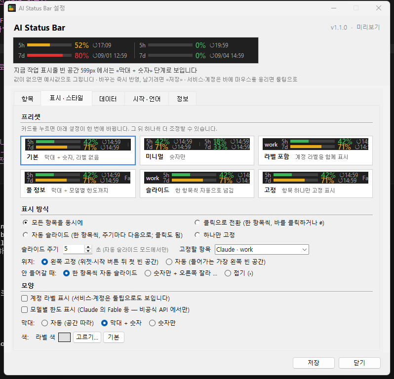

# AI Status Bar

> **Anthropic · OpenAI · GitHub 등 어느 회사와도 무관한 개인 오픈소스입니다.** 각 서비스의 이름은 그 회사의 상표입니다.

Windows 작업 표시줄의 빈 공간에 **AI 구독의 사용량(5시간 / 주간 한도)** 을 상시 표시하는 작은 도구입니다.
설정 페이지를 열지 않아도 지금 얼마나 썼는지, 언제 리셋되는지 한눈에 보입니다.
macOS 는 **메뉴 막대 글자**로 같은 값을 보여줍니다 → [macOS 메뉴 막대 판](#macos-메뉴-막대-판).


```
Claude work   5h ▬▬▬░░░░░ 23% ↺12:09   │   Codex work   5h ▬░░░░░░░  4% ↺17:10
              7d ▬▬▬▬▬░░░ 66% ↺09/01   │                7d ▬▬░░░░░░ 12% ↺09/03
```

*(English below)*

## 먼저 알아둘 점 — 약관과 위험

- 이 앱의 «비공식 API 모드» 는 Anthropic·OpenAI 가 **문서화하지 않은 엔드포인트**를 Claude Code / Codex CLI 가 저장해 둔 로그인 토큰으로 호출합니다.
  **각 서비스의 약관상 계정 제한 사유가 될 수 있습니다.** 실제로 제재된 사례는 알려진 바 없지만, 그렇지 않다고 보장할 수 없습니다.
  위험을 이해하고 **자기 책임으로** 쓰세요. 걱정되면 네트워크에 아무것도 보내지 않는 [공식 모드](#공식-모드--비공식-api-를-쓰지-않는-선택지-claude-code) 를 쓰세요.
- 비공식 경로라 각 회사가 바꾸면 «⚠ HTTP 4xx» 를 표시하고 멈춥니다 — 다른 우회를 시도하지 않습니다. **무보증.**

## 지원 서비스

| 서비스 | 계정 = 이 파일이 있는 폴더 | 창 | 데이터 원본 |
|---|---|---|---|
| **Claude Code** (Claude Pro/Max) | `%USERPROFILE%\.claude\.credentials.json` (또는 `CLAUDE_CONFIG_DIR`) — macOS 는 로그인 키체인의 «Claude Code-credentials» 항목 | 5시간 · 7일 · 모델별(Fable 등) | 비공식 API **또는** 공식 모드(상태줄 데이터, 네트워크 0) |
| **Codex** (ChatGPT Plus/Pro/Team) | `%USERPROFILE%\.codex\auth.json` (또는 `CODEX_HOME`) — macOS 는 `~/.codex/auth.json` | 5시간 · 주간 | 비공식 API |

계정을 여러 개(예: 회사·개인) 두면 항목이 여러 개가 됩니다. 항목 = 서비스 × 계정.

## 특징

- **2줄 표시, 필요한 정보만** — 위 5시간, 아래 주간. 리셋 시각은 「몇 분 후」가 아니라 이 PC 현지 시각(`↺12:10`, 오늘이 아니면 `↺09/01 13:00`).
  서비스·계정·플랜·마지막 조회는 바에 **마우스를 올리면 카드 툴팁**(서비스 칩 · 창별 미니 막대 · 플랜 칩)으로 보이고, 올린 항목은 둥글게 강조됩니다 — 바 자체에는 글자를 더 얹지 않습니다.
- **색** — 초록(<50%) · 노랑(50~79%) · 빨강(80%+). 80% / 95% 를 넘는 순간 알림 1회.
- **표시 방식 커스텀** — 모든 항목 동시에 / 클릭으로 전환 / 자동 슬라이드(주기 설정) / 하나 고정. 항목 순서·라벨·창(5h/7d) 선택.
- **스타일** — 계정 라벨 on/off(기본 off), 막대 «자동 / 막대+숫자 / 숫자만», 라벨 색.
- **설정 창 = 라이브 미리보기 + 프리셋** — 어떤 값을 바꿔도 위쪽 미리보기가 즉시 다시 그려지고, «기본 / 미니멀 / 클릭 전환 / 풀 정보 / 슬라이드 / 고정» 카드를 누르면 한 번에 적용됩니다. «저장» 은 적용만 하고 창은 남습니다(닫기는 따로).
- **배경 투명** — 글자·막대만 그려지고, 나머지 영역은 클릭이 작업 표시줄로 통과합니다.
- **빈 공간 자동 배치** — 작업 표시줄을 캡처해 실제로 비어 있는 열을 찾고, 그중 가장 왼쪽에 놓습니다. 해상도·정렬·위젯·앱 수가 달라도 같은 코드가 돕니다.
  왼쪽 날씨 위젯의 경계는 UI Automation 으로 읽고(외부 프로세스 없이 COM 직접 호출; 검증에 실패하면 픽셀 결과만 씀), 위젯 바로 뒤에는 28px 여백을 둡니다. 20초마다 다시 재고, 2초마다 우리 자리 양끝 밑에 뭔가 들어왔는지 확인해 즉시 옮깁니다.
- **폭에 따라 3단계** — 막대+숫자 → 숫자만 → `›` 버튼(누르면 위로 상세 팝업).
- **깜빡이지 않음** — 창을 화면 캡처에서 제외(`WDA_EXCLUDEFROMCAPTURE`)해 두고 재므로, 앱을 바꿔도 바가 숨었다 나타나지 않습니다. 전체화면 앱이 앞에 오면 숨깁니다.
- **작업 표시줄 버튼을 차지하지 않음** — 오른쪽 `^` 트레이 안의 아이콘으로만 존재합니다.
- **파이썬 불필요** — zip 을 풀어 실행하면 끝. 설치 프로그램·레지스트리·자기 복사 없음.
- **지원 언어** — 한국어 · English · 日本語 · Português (Brasil) · Español. Windows 표시 언어를 따르며 설정에서 바꿀 수 있습니다.

## 설치

1. 이 PC 에서 [Claude Code](https://code.claude.com) 나 [Codex CLI](https://developers.openai.com/codex) 로 **한 번 로그인**돼 있어야 합니다 (위 표의 파일이 그때 생깁니다).
2. [Releases](https://github.com/YeoJeongHun1/ai-status-bar/releases) 에서 `AIStatusBar-<버전>-win64.zip` 을 받아 **원하는 폴더에 풉니다** (예: `%LOCALAPPDATA%\Programs\AIStatusBar`). macOS 는 같은 릴리스의 `AIStatusBar-<버전>-macos-arm64.zip` → [macOS 절](#설치-macos).
   릴리스에 같이 올리는 `.sha256` 파일로 내려받은 zip 을 검증할 수 있습니다: `certutil -hashfile AIStatusBar-<버전>-win64.zip SHA256`.
3. 푼 폴더의 `AIStatusBar.exe` 를 실행 → 시작 설정 창에서 계정이 잡혔는지 확인하고 「로그인할 때 자동 시작」을 고른 뒤 **시작**.



- 프로그램은 **풀어 둔 자리에서 그대로** 돕니다. 자동 시작은 시작프로그램 폴더의 바로가기 하나뿐입니다.
- **제거** — 순서가 중요합니다:
  1. **공식 모드를 썼다면** 먼저 설정 창의 «상태줄 연결 해제» 를 누르거나 `AIStatusBar.exe --unlink-statusline` 을 실행합니다.
     이걸 빼먹고 폴더를 지우면 Claude Code 가 상태줄을 그릴 때마다 사라진 스크립트를 실행하려다 실패합니다(수동 복구는 [공식 모드](#공식-모드--비공식-api-를-쓰지-않는-선택지-claude-code) 절).
  2. 자동 시작을 끕니다(설정 창 또는 `AIStatusBar.exe --no-autostart`).
  3. 폴더를 지웁니다. 남는 것은 `%LOCALAPPDATA%\AIStatusBar\`(설정·오류 로그·공식 모드 파일) 뿐이며, 그것도 지워도 됩니다.

### 백신·SmartScreen 이 막을 때

코드 서명이 없는 개인 오픈소스라 **처음 보는 exe** 취급을 받습니다.

- **Windows SmartScreen** 「확인되지 않은 앱」 → 「추가 정보 → 실행」.
- **Microsoft Defender** 가 `Trojan:Win32/Sabsik.*!ml` · `Wacatac.*!ml` 처럼 끝에 `!ml` 이 붙은 이름으로 잡는다면 머신러닝 휴리스틱의 **오탐**입니다.
  이 판단을 유발하는 요소는 처음부터 뺐습니다 — 단일 exe(임시 폴더에 풀어 실행) 대신 **폴더 배포**, 자기 복사·자기 삭제 코드 없음, 앱 자체가 외부 프로세스를 띄우지 않음(예외는 공식 모드 — 아래 절에 정확히 적었습니다), 버전 정보 리소스 포함. 같은 Defender 엔진의 로컬 스캔에서 폴더·zip 모두 위협 0 입니다.
- 그래도 잡히면: ① Defender 「보호 기록」에서 «허용» ② [Microsoft 에 오탐 신고](https://www.microsoft.com/wdsi/filesubmission) ③ 못 믿겠으면 「소스로 실행」 — 코드 전부가 이 저장소에 있습니다.
- 근본 해결은 코드 서명 인증서(연 수십만 원)뿐이라, 사용자가 늘면 [GitHub Sponsors](https://github.com/sponsors/YeoJeongHun1) 로 마련할 계획입니다.

### 사용

| 동작 | 결과 |
|---|---|
| 왼쪽 클릭 | 「클릭으로 전환·자동 슬라이드」 모드면 다음 항목. 그 외엔 새로고침(막대 모드) / 상세 팝업(`›` 모드) |
| 오른쪽 클릭 | 메뉴 — 설정 · 다음 항목 · 새로고침 · 빈 공간 다시 재기 · 각 서비스 사용량 페이지 · 사용 방법 · 종료 |
| 트레이 `^` 안 아이콘 | 우클릭(또는 더블클릭) — 설정 · 다음 항목 · 새로고침 · 사용 방법 · 종료 |

«새로고침» 은 연타해도 **10초에 한 번**만 실제 조회합니다(비공식 API 에 남의 토큰으로 폭주하지 않게).

### 설정 창

트레이 아이콘 또는 바 우클릭 → **설정…** (`AIStatusBar.exe --setup` 으로도 열림)

- **항목 (서비스 × 계정 폴더)** — 표시 on/off · 라벨(기본값: 로그인 이메일의 `@` 앞부분) · 창(5h/7d) · 순서 ▲▼ · 삭제.
  «다시 탐색» 은 모든 서비스의 기본 폴더와 환경변수(`CLAUDE_CONFIG_DIR`, `CODEX_HOME`)를 자동으로 찾고, «폴더 추가…» 로 서비스를 고른 뒤 아무 폴더나 직접 지정할 수 있습니다.
  «계정이 안 보여요?» 가 서비스별로 안 뜨는 이유를 설명합니다.
- **데이터 원본** — 비공식 API(5분마다) 또는 공식 모드(아래 절). 공식 모드에서 공식 데이터가 없는 항목(Codex)은 숨길 수 있습니다.
- **표시 방식** — 모든 항목 동시에 / 클릭으로 전환 / 자동 슬라이드(5~3600초) / 하나 고정(항목 선택). 자동 슬라이드는 **마우스가 바 위에 있는 동안 멈추고**, 벗어나면 주기를 처음부터 다시 셉니다.
  - **캐러셀** — «클릭으로 전환»·«자동 슬라이드»에서는 항목 영역 전체가 클릭 대상(누르면 다음). 바 왼쪽 끝에 페이지 점 `● ○ ○`(현재 항목 밝게, 점을 누르면 그 항목으로, 올리면 «2/3 · Codex work»). 점 대신 «왼쪽 ⇄ 버튼» 또는 «없음»으로 바꿀 수 있습니다. 점 간격이 고정이라 항목 폭이 바뀌어도 위치가 안 흔들립니다.
  - **위치** — «왼쪽 고정»(기본): 위젯·시작 버튼 뒤 첫 빈 공간에만 놓고 다른 빈 공간으로 건너뛰지 않습니다. «자동»: 들어가는 가장 왼쪽 빈 공간.
  - **안 들어갈 때** — 막대+숫자 → 숫자만 순으로 줄여 보고, 그래도 안 들어가면 정책대로: «한 항목씩 자동 슬라이드»(기본, 주기 = 슬라이드 주기) / «숫자만 + 오른쪽 잘라 …» / «접기 ›». 임시 조절이라 설정은 바뀌지 않고, 공간이 **여유 40px 이상** 으로 돌아오면 조용히 원래대로 돌아갑니다(경계에서 왔다 갔다 하지 않게). 조절이 시작되는 순간 트레이 알림 — **같은 알림은 10분에 한 번**까지만 — 과 미리보기 안내줄·트레이 툴팁에 «자동 조절» 표시.
- **표시 · 스타일 탭** — 프리셋 카드(미리보기 그림 포함) · 표시 방식 · 라벨 표시 · 막대 «자동/막대+숫자/숫자만» · 라벨 색 · 모델별 한도 표시. 맨 위 미리보기는 현재 폼 값을 그대로 그립니다(값이 없으면 예시값). 미리보기는 설정 창 안에서만 쓰이고, 조회는 항상 **저장된 설정**으로만 나갑니다.
- **저장** — 적용하고 창은 그대로(«저장됨 ✓»). 저장하지 않고 닫으면 저장/버리기/취소를 묻습니다.
- **시작** — Windows 로그인 시 자동 시작 (시작프로그램 폴더 바로가기, 관리자 권한 불필요).
- **언어** — 시스템 기본 / 5개 언어.
- **정보** — 동작 방식 요약, 약관 고지, 제거 안내, «오류 로그 폴더 열기».

명령줄: `--setup` 설정 창 열기 · `--autostart` / `--no-autostart` 자동 시작 켜기/끄기 · `--unlink-statusline` 모든 계정의 상태줄 연결 해제 (전부 조용히 실행하고 끝남)

환경변수 `AI_STATUS_BAR_POLL_SEC` 로 조회 주기(초)를 바꿀 수 있지만 **60초 밑으로는 내려가지 않습니다** (0·음수·문자면 기본 300).

### 소스로 실행

Python 3.11 이상.

```bat
pip install pillow pystray pywin32
pythonw ai_status_bar.py
```

테스트: `pip install pytest` 후 `python -m pytest tests` (리다이렉트 차단·디바운스/백오프·i18n 키 일치·설정 마이그레이션·상태줄 스크립트 필드 선별을 검사합니다).
exe 다시 만들기: `build.cmd` (PyInstaller, 폴더 빌드 + zip + `.sha256`).

## macOS 메뉴 막대 판

`ai_status_bar_mac.py` / `AI Status Bar.app` — Windows 판과 **같은 기능**을 macOS 메뉴 막대에 맞는 UI 로. 작업 표시줄 빈 공간 대신 **메뉴 막대 글자**이고, 마우스 호버 카드 대신 **클릭 메뉴 상단의 카드**, 설정 창은 네이티브(AppKit) 5탭입니다. 조회·파싱·네트워크 규칙·백오프·i18n·로그는 Windows 판과 같은 파일(`providers/`·`polling.py`·`i18n.py`·`applog.py`)을 그대로 씁니다.

```
[▬▬░░] 5h 23% · 7d 66%                     항목 하나 (막대 + 숫자)
work [▬▬░░] 5h 23% · 7d 66% · Fable 45%    라벨 · 모델별 한도 켠 경우
C [▬▬░░] 23%/66% · X [▬░░░] 4%/12%          항목 여럿 «모든 항목 동시에» (C = Claude, X = Codex)
●○ work [▬▬░░] 5h 23% · 7d 66%              «클릭 전환 / 자동 슬라이드» — 페이지 점(또는 ⇄)
5h 23% · 7d 66%      ›                     숫자만 단계 · 접힘(›) 단계
```

### 특징 (Windows 판과의 대응)

- **막대 + 숫자, 2줄 미니 막대** — 항목마다 숫자 앞에 위 5h · 아래 7d 막대(36×12pt, Pillow 로 그린 2x 투명 PNG 를 `NSTextAttachment` 로 끼움). 색은 초록(<50%) · 노랑(50~79%) · 빨강(80%+), 트랙은 반투명 회색이라 다크·라이트 메뉴 막대 양쪽에서 보임. 값이 없으면 빈 트랙, 조회 전 `…`, 오류 `⚠`, 계정 없음 `AI —`.
- **리셋 현지시각·서비스·계정·플랜·마지막 조회** — 메뉴 막대 항목은 hover 가 없으므로 **클릭 → 메뉴 맨 위 항목 카드**(서비스 칩 · 라벨 · 창별 미니 막대와 % · 리셋 · 모델별 칩 · 플랜 칩 · 조회/오류/다음 조회). 전환 모드에서 지금 보이는 항목은 카드가 강조되고, 카드를 누르면 그 항목으로 갑니다(Windows 의 페이지 점 클릭).
- **표시 방식 4종** — 모든 항목 동시에 / 클릭으로 전환(메뉴 막대에선 클릭이 메뉴라 **⌥클릭** 또는 «다음 항목» 메뉴) / 자동 슬라이드(5~3600초) / 하나 고정. 캐러셀 표시는 제목 앞 글리프 `● ○ ○` / `⇄` / 없음.
- **폭에 따라 3단계 + 넘침 정책** — 막대+숫자 → 숫자만 → `›`. macOS 는 메뉴 막대가 차면 왼쪽 항목부터 숨기므로(Windows 처럼 빈 공간을 잴 수 없음) **우리 항목의 창이 화면 왼쪽 밖(x<0)으로 밀리면** 넘침으로 보고 정책대로 «한 항목씩 자동 슬라이드 / 숫자만 + 오른쪽 잘라 … / 접기 ›» 로 임시 조절합니다(설정은 그대로). 조절 시작 때 알림 1회(같은 알림은 10분에 한 번), 60초마다 원래 단계로 돌아갈 수 있는지 다시 재고 **여유 40pt 이상**일 때만 복귀(경계 진동 방지). 설정 «메뉴 막대 최대 폭(pt)» 을 주면 감지 대신 그 값으로 같은 정책을 돌립니다. 이 감지는 «지금 밀려났나»만 알 뿐 Windows 처럼 빈 공간 px 을 재는 것이 아니라, 미리보기의 «필요한 폭 N pt» 는 우리 항목이 차지할 폭입니다.
- **스타일** — 계정 라벨 on/off · 막대 «자동(= 막대+숫자) / 막대+숫자 / 숫자만» · 라벨 색(NSColorPanel) · 모델별 한도 표시.
- **설정 창 = 라이브 미리보기 + 프리셋 6종** — 아래 [설정 창](#설정-창-macos).
- **80% / 95% 알림 1회**, **색·언어 5종**(시스템 «선호 언어» 자동 감지), **조회 하한 60초·백오프·10초 디바운스·리다이렉트 금지·허용 호스트** — Windows 와 같은 코드.
- **Dock 아이콘·⌘Tab 없음** — 메뉴 막대에만 존재(`LSUIElement`). 단일 인스턴스(잠금 파일). 크래시는 `error.log`.
- **해당 없음(맥에 개념이 없음)** — 작업 표시줄 빈 공간 계측·날씨 위젯 경계·`WDA_EXCLUDEFROMCAPTURE`·전체화면 숨김(메뉴 막대는 macOS 가 관리)·시작프로그램 폴더 바로가기(→ LaunchAgent)·SmartScreen(→ Gatekeeper).

### 설치 (macOS)

1. 이 맥에서 [Claude Code](https://code.claude.com) 나 [Codex CLI](https://developers.openai.com/codex) 로 **한 번 로그인**돼 있어야 합니다 (Claude 는 키체인 항목, Codex 는 `~/.codex/auth.json` 이 그때 생깁니다).
2. **번들** (**Apple Silicon · macOS 26 이상** — 번들에 들어간 Homebrew Python 3.14 의 최소 요구; Intel 이나 그 이하 macOS 는 아래 «소스» 로): [Releases](https://github.com/YeoJeongHun1/ai-status-bar/releases) 의 `AIStatusBar-<버전>-macos-arm64.zip` 을 받아 **Finder 에서 더블클릭**(아카이브 유틸리티) 또는 `ditto -x -k AIStatusBar-<버전>-macos-arm64.zip .` 으로 풀고 `AI Status Bar.app` 을 `~/Applications` 에 넣습니다 (`unzip` 도 됩니다 — zip 에 AppleDouble `._*` 파일을 넣지 않아 어느 쪽으로 풀어도 서명이 유지됩니다). 검증: `shasum -a 256 -c AIStatusBar-<버전>-macos-arm64.zip.sha256`. 번들은 Python 설치가 필요 없습니다(자체 파이썬 포함).
   **소스**: `git clone https://github.com/YeoJeongHun1/ai-status-bar && cd ai-status-bar && zsh mac/install.sh` — `dist/AI Status Bar.app` 이 있으면 그것을 `~/Applications` 에 복사하고, 없으면 `~/Library/Application Support/AIStatusBar/venv` 에 `requirements-mac.txt`(버전 고정) 를 설치해 소스로 돕니다(`--build` 로 번들을 직접 만들어 설치, `--source` 로 소스 강제). Python 3.11+ 필요(Homebrew `python3`; `/usr/bin/python3` 은 3.9 라 안 됨).
3. 처음 실행하면 **시작 설정 창**이 뜹니다 → 계정이 잡혔는지 확인, «로그인할 때 자동 시작» 을 고른 뒤 **시작**. `install.sh` 는 LaunchAgent(`~/Library/LaunchAgents/com.yeojeonghun.ai-status-bar.plist`, RunAtLoad·KeepAlive 없음)를 등록하고 바로 띄웁니다.

- 프로그램은 **둔 자리에서 그대로** 돕니다(번들은 `~/Applications`, 소스는 클론 폴더). 자동 시작은 LaunchAgent plist 하나뿐. sudo·시스템 폴더 없음.
- **제거** — 순서가 중요합니다(Windows 와 같은 이유): ① 공식 모드를 썼다면 설정 창의 «상태줄 연결 해제» 또는 `--unlink-statusline` ② «로그인할 때 자동 시작» 끄기(또는 `--no-autostart`) ③ `zsh mac/uninstall.sh`(①②③ 를 순서대로 하고 번들을 지움) 또는 번들·폴더 삭제. 남는 것은 `~/Library/Application Support/AIStatusBar/`(설정·venv·공식 모드 파일)와 `~/Library/Logs/AIStatusBar/` 뿐이며 지워도 됩니다.

### Gatekeeper 가 막을 때

코드 서명(Apple Developer ID, 연 $99)이 없는 개인 오픈소스라 **처음 보는 앱** 취급을 받습니다. `build_mac.sh` 는 ad-hoc 서명만 합니다(`spctl` 은 rejected).

- 내려받은 zip 을 풀어 열면 «Apple 이 악성 소프트웨어가 없는지 확인할 수 없습니다» 가 뜨고 열리지 않습니다 → ① **시스템 설정 › 개인정보 보호 및 보안** 아래쪽의 «"AI Status Bar" 은(는) 차단되었습니다 … **그래도 열기**» 를 누른 뒤 다시 엽니다 (macOS 15 Sequoia 부터는 **우클릭 → 열기 가 통하지 않습니다**; 14 이하에서는 우클릭 → 열기 한 번으로 됩니다). ② 터미널이면 `xattr -d com.apple.quarantine "AI Status Bar.app"` 뒤 실행.
- 소스로 설치(`install.sh`)하거나 직접 빌드(`build_mac.sh`)한 앱에는 격리 속성이 없어 경고 없이 열립니다 — 못 믿겠으면 이 길을 쓰세요. 코드 전부가 이 저장소에 있습니다.
- 근본 해결은 Developer ID 서명 + 공증뿐이라, 사용자가 늘면 [GitHub Sponsors](https://github.com/sponsors/YeoJeongHun1) 로 마련할 계획입니다.

### 사용 (macOS)

| 동작 | 결과 |
|---|---|
| 클릭 | 메뉴 — 맨 위 **항목 카드**(Windows 의 호버 카드·상세 팝업) · 설정… · 다음 항목(전환 모드) · 지금 새로고침 · 다시 탐색 · 각 서비스 사용량 페이지 · 표시 방식 · 막대 · 라벨 · 모델별 한도 · 데이터 원본(+상태줄 연결) · 로그인할 때 자동 시작 · 언어 · 정보 · 오류 로그 폴더 · 사용 방법 · 종료 |
| ⌥클릭 | Windows 왼쪽 클릭: «클릭으로 전환·자동 슬라이드» 면 다음 항목, 그 외엔 새로고침 |
| ⌘클릭 | 새로고침 |
| ⇧클릭 | 설정 창 |
| 카드 클릭 | 전환 모드면 그 항목으로(페이지 점), 아니면 설정 «항목» 탭 |

«새로고침» 은 연타해도 **10초에 한 번**만 실제 조회합니다. 메뉴는 열 때마다 최신 값으로 다시 만듭니다.

### 설정 창 (macOS)

메뉴 › **설정…** (⇧클릭, `--setup` — 이미 떠 있으면 그 인스턴스의 창을 엽니다). 네이티브 AppKit 창, 맨 위에 **라이브 미리보기**(현재 폼 값으로 메뉴 막대 세그먼트를 그대로 그린 이미지 — 값이 없으면 예시값, «필요한 폭 N pt · 지금 단계»).

- **항목** — 서비스×계정 폴더 목록: 표시 on/off · 라벨 편집 · 창(5h/7d) · 순서 ▲▼ · 삭제 · 연결 상태 · «상태줄 연결 설치/해제». «다시 탐색»(키체인 항목·`CLAUDE_CONFIG_DIR`·`CODEX_HOME`·홈의 `.claude*`/`.codex*`), «폴더 추가…»(서비스 선택 → 숨김 폴더가 보이는 NSOpenPanel), «계정이 안 보여요?»(macOS 키체인 설명 포함).
- **표시 · 스타일** — 프리셋 카드 6종(기본 / 미니멀 / 클릭 전환 / 풀 정보 / 슬라이드 / 고정 — 미리보기 그림 포함, 누르면 한 번에 적용) · 표시 방식 4종 + 슬라이드 주기(5~3600) + 고정할 항목 · 위치(Windows 키 보존) · 넘침 정책 · 전환 표시 · **메뉴 막대 최대 폭(pt, 0 = 자동 감지)** · 계정 라벨 · 모델별 한도 · 막대 «자동/막대+숫자/숫자만» · 라벨 색(고르기… / 기본).
- **데이터** — 비공식 API / 공식 모드, 공식 데이터 없는 항목 숨기기, 계정 연결 상태(플랜·토큰 만료·마지막 조회·오류·다음 조회·상태줄 연결됨), «연결 다시 확인».
- **시작 · 언어** — 로그인할 때 자동 시작(LaunchAgent), 언어(시스템 기본 + 5개).
- **정보** — 버전, 동작 방식 요약(읽는 것 / 키체인 / 보내는 것 / 저장하는 것), README·릴리스·후원 링크, «계정이 안 보여요?», «오류 로그 폴더 열기», 약관 고지, 클릭 조합 안내, 제거 안내, Gatekeeper 안내, 상표 고지.
- **저장** — 적용하고 창은 그대로(«저장됨 ✓»). 저장하지 않고 닫으면 저장/버리기/취소. 언어를 바꾸면 창을 새 언어로 다시 엽니다. 미리보기는 창 안에서만 쓰이고, 조회는 항상 **저장된 설정**으로만 나갑니다.

명령줄: `--setup` 설정 창 · `--autostart` / `--no-autostart` LaunchAgent 등록(+즉시 기동) / 해제(+그 잡이 띄운 앱 종료) · `--unlink-statusline`. `AI_STATUS_BAR_POLL_SEC` 도 같습니다(60초 하한).

### 소스로 실행 (macOS)

Python 3.11 이상 (Homebrew).

```sh
python3 -m venv .venv && .venv/bin/pip install -r requirements-mac.txt
.venv/bin/python ai_status_bar_mac.py
```

테스트: `pip install pytest` 후 `python -m pytest tests --ignore=tests/test_settings.py`(Windows 판 설정 테스트는 tkinter 필요). macOS 전용: `test_mac_credentials.py`(`security` 를 흉내 낸 키체인 파싱·거부·다이얼로그 대기·폴백), `test_mac_title.py`·`test_mac_bars.py`(제목·막대 PNG 픽셀), `test_mac_settings.py`·`test_mac_settings_model.py`(설정 스키마·폼·프리셋·행 조작·넘침 상태 기계), `test_mac_window_smoke.py`(설정 창을 실제로 만들어 프리셋 → 미리보기 → 저장 경로), `test_mac_app_regressions.py`(UI 경로에서 키체인 `-w` 0회 · 메뉴 토글 연타 디바운스 · 언어 전환), `test_statusline_sh.py`(zsh 스크립트 실제 실행). 번들 다시 만들기: `zsh build_mac.sh`(py2app 0.28.10 고정, `dist/AI Status Bar.app` + `AIStatusBar-<버전>-macos-<arch>.zip` + `.sha256`, `app.ico` → `.icns`; Info.plist 의 빌드 경로 제거 · `.pyc` 소스 경로 중립화 · `ditto --sequesterRsrc` · `unzip` 후 `codesign --verify --deep --strict` 실측까지 스크립트가 합니다). 최소 macOS 는 빌드에 쓴 파이썬의 `minos` 를 그대로 적습니다.

### 어떻게 동작하나 (macOS 에서 다른 것만)

Windows 절의 네트워크 규칙·Claude Code·Codex 요청·응답은 **그대로**입니다. 다른 것:

| | 읽는 곳 | 방법 |
|---|---|---|
| Claude Code 토큰 | 로그인 키체인의 «Claude Code-credentials» 항목 (macOS 의 Claude Code 는 `.credentials.json` 을 만들지 않습니다) | `/usr/bin/security find-generic-password -s "Claude Code-credentials" -w` — Apple 기본 도구, 추가 의존성 없음. 폴더에 `.credentials.json` 이 있으면 그 파일을 먼저 씁니다 |
| Claude Code 라벨 | `~/.claude.json` 의 `oauthAccount.emailAddress` | Windows 와 같음 |
| Codex | `~/.codex/auth.json` (또는 `CODEX_HOME`) | Windows 와 같음 |

키체인의 비밀 값을 처음 읽을 때 macOS 가 **«허용 / 항상 허용»** 을 물을 수 있습니다. 그동안 카드와 설정 창에 «키체인 접근 허용 필요» 가 보이고 앱은 죽지 않습니다 — «항상 허용» 을 누르면 다음 조회부터 됩니다. 계정 존재 확인(«다시 탐색»)은 항목의 메타데이터만 보므로 다이얼로그가 뜨지 않습니다. 키체인 항목은 사용자당 하나라 **기본 폴더(`~/.claude` 또는 `CLAUDE_CONFIG_DIR`)에만** 대응합니다 — 계정 여러 개는 폴더별 `.credentials.json` 이 있을 때만. 토큰은 요청 헤더에만 쓰고 갱신·저장·로그하지 않습니다.

**저장하는 것** — 설정 `~/Library/Application Support/AIStatusBar/settings.json`(Windows 와 같은 스키마 + `max_width_pt`; 파일을 옮겨도 읽힘) · 오류 로그 `~/Library/Logs/AIStatusBar/error.log`(같은 마스킹 — 화면의 오류 문구도 같은 마스킹을 거칩니다; `launchd.log` 는 stdout/stderr) · 공식 모드 파일 `~/Library/Application Support/AIStatusBar/official/<key>.json` · 자동 시작 plist(현재 셸에 `CLAUDE_CONFIG_DIR`/`CODEX_HOME` 이 있으면 `EnvironmentVariables` 로 함께 기록) · 잠금 파일 `app.lock` · rumps 가 만드는 빈 폴더 `~/Library/Application Support/AI Status Bar/`. 키체인의 비밀 값(`security -w`)은 **폴링 스레드에서만** 읽고 메뉴·설정 창은 그 결과의 캐시만 봅니다 — 거부되면 다른 오류처럼 지수 백오프해 «허용» 다이얼로그를 5분마다 다시 띄우지 않습니다.

**띄우는 외부 프로세스** — `/usr/bin/security`(키체인 읽기), `/bin/launchctl`(자동 시작 켜고 끌 때), `/usr/bin/open`(로그 폴더·링크), 알림 폴백 때 `/usr/bin/osascript`. 공식 모드를 연결하면 *Claude Code 가* 상태줄을 그릴 때마다 `/bin/zsh "<앱>/statusline_export.sh"` 를 실행합니다(아래).

### 공식 모드 (macOS)

Windows 의 `statusline_export.ps1` 과 같은 규약의 `statusline_export.sh`(zsh): `rate_limits`(5h/7d 사용률·리셋)와 모델명만 `official/<key>.json` 에 PID 임시파일을 거쳐 저장하고, 원래 상태줄 명령이 있었으면 그 JSON 을 그대로 `/bin/sh -c <원래 명령>` 에 넘깁니다(명령 문자열은 인자 하나로 전달, 보간 없음). 없었으면 `모델 | 5h xx% | 7d xx%`. JSON 처리는 번들의 자체 파이썬(`AI Status Bar.app/Contents/MacOS/python`) → 소스 설치의 venv 파이썬 → PATH 의 `python3` 순으로 찾습니다(번들 설치엔 Python 설치가 필요 없음; 셋 다 없으면 아무것도 저장·출력하지 않음). `<key>` 는 폴더 절대경로(끝 `/` 제거)의 SHA-1 앞 12자 — `providers/claude_code.py` 와 같습니다. 설정 창 «항목» 탭(또는 메뉴 «데이터 원본»)의 «상태줄 연결 설치» 가 확인창 뒤 `~/.claude/settings.json` 을 `.bak-aistatusbar` 로 백업하고 `statusLine` 을 바꿉니다. 해제는 «상태줄 연결 해제» 또는 `--unlink-statusline`. 번들 설치면 스크립트는 `AI Status Bar.app/Contents/Resources/statusline_export.sh` 입니다 — 번들을 옮기면 연결을 다시 하세요.

## 어떻게 동작하나 — 투명하게

이 프로그램이 디스크에서 읽는 것, 네트워크로 보내는 것, 받는 것, 저장하는 것을 전부 적습니다.
네트워크 코드는 `providers/http.py` 의 `get_json()` **하나**이고, 서비스별 파일(`providers/`)이 그것을 요청 한 번씩 부릅니다.

### 네트워크 규칙 (`providers/http.py`)

- **리다이렉트를 따라가지 않습니다.** 30x 응답은 오류(«서버가 다른 주소로 보내려 함 — 안전을 위해 중단»)로 끊습니다. 기본 urllib 은 다른 호스트로 튕겨도 `Authorization` 헤더를 붙여 따라가므로, 프록시·DNS 오염·벤더의 30x 한 번이면 토큰이 샐 수 있습니다 — 그래서 막았습니다 (`tests/test_http.py` 가 로컬 서버 두 개로 실증합니다).
- 요청 전에 URL 호스트가 허용 목록(`api.anthropic.com`, `chatgpt.com`)에 있는지 확인합니다. 목록 밖이면 요청 자체를 보내지 않습니다.
- GET 만, 본문 없음, 타임아웃 15초. 429 는 `Retry-After` 를 읽어 그만큼 쉬고, 5xx·네트워크 오류는 60초 → 120 → 240 … 최대 30분으로 계정별 지수 백오프합니다(성공하면 리셋). 툴팁·설정 창에 «다음 조회 hh:mm» 이 보입니다.
- 조회는 한 번에 하나만 돕니다(인플라이트 락). 수동 새로고침은 10초 디바운스.

### Claude Code (`providers/claude_code.py`)

**디스크에서 읽는 것** (읽기만)

| 파일 | 읽는 항목 | 용도 |
|---|---|---|
| `<설정 폴더>\.credentials.json` | `claudeAiOauth.accessToken`, `expiresAt`, `subscriptionType`, `rateLimitTier` | 토큰은 요청 헤더에만. 나머지는 설정 창 «연결 상태» |
| `<설정 폴더>\.claude.json` (기본 폴더는 `%USERPROFILE%\.claude.json`) | `oauthAccount.emailAddress` | 라벨(`@` 앞부분)만 |

**보내는 것** (비공식 API 모드, 계정마다 5분에 한 번 + «새로고침» 때)

```http
GET https://api.anthropic.com/api/oauth/usage
Authorization: Bearer <accessToken>
anthropic-beta: oauth-2025-04-20
User-Agent: ai-status-bar/<버전>
```

**받아서 쓰는 것** — `five_hour.utilization/resets_at`, `seven_day.utilization/resets_at`, `limits[kind=weekly_scoped].percent/scope.model.display_name`. 나머지는 버립니다.

이 엔드포인트는 Anthropic 이 **문서화하지 않은 비공식** 경로입니다(개인 구독자용 공식 사용량 API 는 없습니다). 공식 데이터만 쓰려면 아래 «공식 모드».

### Codex (`providers/codex.py`)

**디스크에서 읽는 것** (읽기만)

| 파일 | 읽는 항목 | 용도 |
|---|---|---|
| `<설정 폴더>\auth.json` | `tokens.access_token`, `tokens.account_id`, `tokens.id_token`, `auth_mode` | 토큰·계정 ID 는 요청 헤더에만. `id_token`/`access_token` 의 JWT claim(`email`, `chatgpt_plan_type`, `exp`)을 **로컬에서 디코드**해 라벨·플랜·만료 표시(서명 검증 없음, 표시용) |

**보내는 것** (계정마다 5분에 한 번 + «새로고침» 때)

```http
GET https://chatgpt.com/backend-api/wham/usage
Authorization: Bearer <access_token>
ChatGPT-Account-Id: <account_id>
User-Agent: ai-status-bar/<버전>
```

**받아서 쓰는 것** — `rate_limit.primary_window.{used_percent, reset_at, limit_window_seconds}` → 5h, `rate_limit.secondary_window.{…}` → 주간. 응답의 `email`·`user_id` 등 **나머지는 읽지 않습니다**.

이 엔드포인트도 OpenAI 가 **문서화하지 않은 비공식** 경로입니다(Codex CLI 의 `/status` 가 쓰는 것과 같은 계열). API 키 방식(`auth_mode: apikey`)은 사용량 창이 없어 지원하지 않습니다.

### 저장하는 것 · 띄우는 것

| 무엇 | 어디 | 내용 |
|---|---|---|
| 설정 | `%LOCALAPPDATA%\AIStatusBar\settings.json` | 표시 설정, 계정 **폴더 경로**와 라벨. 토큰·사용량 값 없음 |
| 오류 로그 | `%LOCALAPPDATA%\AIStatusBar\logs\error.log` (256KB × 3 회전) | 잡히지 않은 예외와 코드가 명시적으로 남긴 경고만. 토큰처럼 보이는 문자열과 경로의 사용자 이름은 가리고 씁니다. 요청·응답·사용량 값은 남기지 않습니다 |
| 공식 모드 파일 | `%LOCALAPPDATA%\AIStatusBar\official\<key>.json` | **공식 모드를 켜고 상태줄 연결을 설치한 계정만.** `rate_limits`(5h/7d 사용률·리셋)·모델명·저장 시각. 즉 **사용량 값이 디스크에 남습니다** — 연결을 해제하면 지웁니다 |
| 자동 시작 | 시작프로그램 폴더의 `AI Status Bar.lnk` | 켠 경우만 |

- 앱 자체는 외부 프로세스를 띄우지 않습니다(자동 시작 바로가기도 프로세스 안 COM 으로 만듭니다).
  **예외는 공식 모드**: 연결을 설치하면 *Claude Code 가* 상태줄을 그릴 때마다 `powershell -NoProfile -ExecutionPolicy Bypass -File …\statusline_export.ps1` 을 실행합니다(이 앱이 띄우는 게 아니라 Claude Code 의 `statusLine` 설정이 띄웁니다). 그 스크립트는 원래 쓰던 상태줄 명령이 있었을 때만 `cmd.exe` 로 그 명령을 실행해 출력을 넘깁니다. `-ExecutionPolicy Bypass` 인 이유: 서명 없는 로컬 스크립트라 `RemoteSigned` 정책에서는 zip 에서 풀린 파일에 붙는 «인터넷에서 받은 파일» 표시 때문에 막힐 수 있어서입니다.
- 레지스트리를 건드리지 않습니다. 통계·오류 보고·업데이트 확인 등 **다른 요청은 없습니다.**
- 토큰을 **갱신하지 않고, 어디에도 저장하지 않습니다.** 만료되면 «⚠» 를 표시하고, 해당 CLI 를 한 번 실행하면 CLI 가 갱신한 파일을 다음 폴링에 다시 읽습니다.
- 방화벽·프록시 로그에서 `api.anthropic.com`·`chatgpt.com` 외 목적지가 보이면 버그이니 이슈로 알려 주세요.

## 공식 모드 — 비공식 API 를 쓰지 않는 선택지 (Claude Code)

설정 창 «데이터 원본» 에서 고릅니다.

| | 비공식 API (기본) | 공식 모드 |
|---|---|---|
| 데이터 | `api.anthropic.com/api/oauth/usage` | Claude Code 상태줄이 **공식으로** 넘겨주는 `rate_limits` — [문서](https://code.claude.com/docs/en/statusline) |
| 네트워크 | 5분마다 요청 1회 | **없음** (로컬 파일만 읽음) |
| 갱신 | 항상 | **Claude Code 세션이 떠 있는 동안만** (세션이 없으면 마지막 값 + «N분 전») |
| 모델별 한도(Fable 등) | 있음 | 없음 |
| Codex | 표시 | 공식 데이터가 없어 숨김(설정으로 «공식 데이터 없음» 표시 가능) |
| 디스크에 남는 것 | 없음 | `official\<key>.json` 에 사용률·리셋·모델명·저장 시각 |

**설치가 무엇을 바꾸나** — 항목 행의 «상태줄 연결 설치» 를 누르면(확인 대화상자 뒤에):
1. 그 계정 폴더의 `settings.json` 을 `settings.json.bak-aistatusbar` 로 **백업**합니다.
2. `statusLine` 을 이 앱의 `statusline_export.ps1` 로 바꿉니다:
   `"statusLine": {"type": "command", "command": "powershell -NoProfile -ExecutionPolicy Bypass -File \"<앱 폴더>\\_internal\\statusline_export.ps1\""}`
3. 원래 `statusLine` 은 `%LOCALAPPDATA%\AIStatusBar\official\<key>.original.json` 에 보관합니다 (Claude Code 의 `settings.json` 에 낯선 키를 넣지 않기 위해 앱 폴더에 둡니다).

이후 Claude Code 가 상태줄을 그릴 때마다 스크립트가 받은 JSON 에서 **`rate_limits`(5h/7d 사용률·리셋)와 모델명만** 골라 `official\<key>.json` 에 저장합니다 — `cwd`·`transcript_path`·`session_id`·비용 같은 나머지는 버립니다. 저장은 프로세스별 임시 파일(`<key>.<pid>.tmp`)을 거쳐 교체하므로 세션이 여럿이어도 서로 덮어쓰지 않습니다. **원래 쓰던 상태줄 명령이 있으면 그 JSON 을 그대로 넘겨 출력을 인쇄**합니다(명령 문자열은 이 스크립트가 보간하지 않고 인자 하나로 `cmd.exe` 에 넘깁니다). 없었다면 `모델 | 5h xx% | 7d xx%` 한 줄을 인쇄합니다. `<key>` 는 설정 폴더 경로의 SHA-1 앞 12자입니다. 새 Claude Code 세션부터 적용됩니다.

**해제 · 수동 복구** — «상태줄 연결 해제»(또는 `AIStatusBar.exe --unlink-statusline`)가 원래 `statusLine` 을 복원하고(없었다면 키 제거) 보관본과 `official\<key>.json` 을 지웁니다. 앱 없이 되돌리려면 `settings.json.bak-aistatusbar` 를 `settings.json` 으로 되돌리거나 `statusLine` 키를 지우면 됩니다.

**알아둘 점** — `rate_limits` 는 구독 계정 + 세션 첫 응답 이후에만 들어옵니다. 상태줄 명령마다 PowerShell 기동 비용(수백 ms)이 더해집니다. 공식 모드에서는 이 앱이 **네트워크 호출 코드를 아예 타지 않습니다.**

## 내 계정이 목록에 안 떠요

이 앱이 «계정»으로 보는 것은 각 CLI 가 로그인 정보를 저장하는 **파일**입니다 — CLI(터미널 앱)로 로그인해야 생기고, 웹·데스크톱 앱만 쓰면 생기지 않습니다.

**Claude Code** (`<설정 폴더>\.credentials.json`)
1. 이 PC 에서 Claude Code 로 로그인한 적이 없다 → 터미널에서 `claude` 실행해 로그인.
2. 같은 폴더에서 `/login` 으로 계정을 바꿔 가며 쓴다 → 파일에는 **마지막 계정 하나만** 남습니다.
3. `claude setup-token` + `CLAUDE_CODE_OAUTH_TOKEN` 환경변수 방식 → 토큰이 파일로 저장되지 않아 **볼 수 없습니다** (지원하지 않음).
4. 설정 폴더가 기본 위치 밖(`CLAUDE_CONFIG_DIR`) → 설정 창 «폴더 추가…».

**Codex** (`<설정 폴더>\auth.json`)
1. `codex login` 을 한 적이 없다 → 터미널에서 `codex login` (ChatGPT 계정).
2. API 키 방식(`auth_mode: apikey`, `OPENAI_API_KEY`) → 5시간/주간 창이 없어 표시할 것이 없습니다 (지원하지 않음).
3. 설정 폴더가 기본 위치 밖(`CODEX_HOME`) → «폴더 추가…».

**계정을 여러 개 동시에** 쓰려면 계정마다 폴더를 나누세요:
```powershell
$env:CLAUDE_CONFIG_DIR = "$HOME\.claude-b"; claude        # Claude Code 두 번째 계정
$env:CODEX_HOME = "$HOME\.codex-b"; codex login            # Codex 두 번째 계정
```
그다음 설정 창에서 «다시 탐색». macOS 는 Claude 토큰을 키체인에 저장해 파일이 없습니다 — macOS 판은 키체인에서 읽습니다([아래](#macos-메뉴-막대-판)). 키체인 항목은 사용자당 하나라 macOS 에서 Claude 계정 여러 개는 `CLAUDE_CONFIG_DIR` 폴더에 `.credentials.json` 이 있는 경우(Linux 식 설정)만 됩니다.

## 알아둘 점

- Windows 11 의 작업 표시줄은 XAML 레이어가 전체를 덮고 있어 자식 창으로 붙이는 방식이 통하지 않습니다. 그래서 「항상 위」 창을 좌표만 맞춰 얹고 2초마다 다시 위로 올립니다. 작업 표시줄을 클릭하면 잠깐 가려졌다 돌아올 수 있습니다.
- 지원: Windows 10/11, 가로 작업 표시줄. 세로 도킹은 미지원. Windows 10 2004 이전에서는 캡처 제외 API 가 없어 재측정 때 0.1초 깜빡일 수 있습니다.
- 위치·크기는 **주 모니터의 작업 표시줄** 기준입니다. 모니터마다 배율(DPI)이 다르면 자리가 어긋날 수 있습니다.
- 이전 이름(Claude Status Bar)의 설정(`%LOCALAPPDATA%\ClaudeStatusBar\settings.json`)과 자동 시작 바로가기는 첫 실행 때 자동으로 이전됩니다.
- 무언가 이상하면 설정 창 «정보» 탭의 «오류 로그 폴더 열기» 로 `error.log` 를 확인해 이슈에 첨부해 주세요(토큰·사용자 이름은 가려져 있습니다).

## 응원

쓸모 있었다면 ⭐ 하나, 또는 [GitHub Sponsors](https://github.com/sponsors/YeoJeongHun1) 로 커피 한 잔 부탁드립니다. 바 안에 광고는 넣지 않습니다.

## 상표 고지

Claude·Anthropic·OpenAI·ChatGPT·Codex 는 각 회사의 상표입니다. 이 앱은 서비스 식별 목적으로 **이름만** 표시하며 로고를 쓰지 않습니다. 두 회사와 무관한 개인 오픈소스입니다.

## 라이선스

MIT

---

# English

> **An independent open-source project, unaffiliated with Anthropic, OpenAI, GitHub or any other company.** Claude, Anthropic, OpenAI, ChatGPT and Codex are trademarks of their respective owners; names are shown only to identify the service, no logos are used.

A tiny Windows utility that shows your **AI subscription usage (5-hour / weekly limits)** in the empty area of the taskbar — always visible, no settings page to open.
On macOS the same numbers live in the **menu bar** → [macOS menu bar version](#macos-menu-bar-version).

## Read this first — terms and risk

- The default "unofficial API mode" calls endpoints that Anthropic and OpenAI **do not document**, using the login token that Claude Code / Codex CLI stored on your PC.
  **That may count as a terms-of-service violation and could get your account restricted.** No such case is known, but it cannot be ruled out. Understand the risk and use it **at your own responsibility**. If in doubt, use [official mode](#official-mode-claude-code), which sends nothing over the network.
- If a vendor changes an endpoint the app shows «⚠ HTTP 4xx» and stops; it never tries workarounds. **No warranty.**

## Supported services

| Service | Account = the folder containing | Windows | Data source |
|---|---|---|---|
| **Claude Code** (Claude Pro/Max) | `%USERPROFILE%\.claude\.credentials.json` (or `CLAUDE_CONFIG_DIR`) — on macOS the «Claude Code-credentials» item in the login Keychain | 5-hour · 7-day · per-model | unofficial API **or** official mode (status-line data, zero network) |
| **Codex** (ChatGPT Plus/Pro/Team) | `%USERPROFILE%\.codex\auth.json` (or `CODEX_HOME`) — `~/.codex/auth.json` on macOS | 5-hour · weekly | unofficial API |

Entry = service × account; several accounts per service are supported.

## Features

- Two lines per entry (5h / weekly) with bars, percentages and the **local reset time**.
- **Only what matters on the bar**: service, account, plan and last fetch appear in a **hover card** (service chip, mini bars per window, plan chip) with the hovered entry highlighted — not on the bar itself.
- **Display modes**: all entries at once / switch on click / auto slide (interval; pauses while the mouse is over the bar and restarts the full interval on leave) / pin one. Per-entry order, label, and which windows to show.
- **Carousel**: in «switch on click» / «auto slide» the whole entry is the click target (click = next). Page dots `● ○ ○` sit at the left edge (current one bright; click a dot to jump, hover for «2/3 · Codex work»); switchable to a left ⇄ button or none.
- **Position**: «fixed left» (default) stays in the first gap after the widgets / Start button and never jumps to another gap; «auto» picks the left-most gap that fits. **When it doesn't fit**: bars → numbers, then the chosen policy — auto slide one entry at a time (default) / numbers only with the right clipped (…) / collapse to ›. Temporary (settings untouched); reverts silently once there is at least 40px of slack again; one tray notification when it kicks in, at most once per 10 minutes.
- **No overlap with the weather widget**: its edge is read via UI Automation (in-process COM, no external process; falls back to pixels if the result cannot be verified) with a 28px gap; the bar re-measures every 20s and checks every 2s whether something slid under its edges.
- **Style**: account label on/off (off by default), bars «auto / bars+numbers / numbers only», label color.
- **Settings = live preview + presets**: every change redraws the preview at the top instantly; preset cards apply a whole look at once. **Save** applies and keeps the window open; closing with unsaved changes asks. The preview is used only inside the window — polling always uses the **saved** settings.
- Transparent, click-through background; auto-placement by measuring the taskbar's empty columns; shrinks to numbers-only, then to a `›` button with a popup.
- No flicker (excluded from screen capture), hides during fullscreen apps, lives as a tray icon (no taskbar button).
- No Python required — unzip and run. No installer, no registry, no self-copy; "run at login" is one Startup-folder shortcut.
- **Languages**: 한국어 · English · 日本語 · Português (Brasil) · Español — the UI follows your Windows display language (screenshots in this README are Korean).

## Install

1. Be logged in once with [Claude Code](https://code.claude.com) and/or [Codex CLI](https://developers.openai.com/codex) on this PC (that is what creates the files in the table above).
2. Download `AIStatusBar-<ver>-win64.zip` from [Releases](https://github.com/YeoJeongHun1/ai-status-bar/releases) and unzip it anywhere (e.g. `%LOCALAPPDATA%\Programs\AIStatusBar`). On macOS take `AIStatusBar-<ver>-macos-arm64.zip` from the same release → [macOS section](#install-macos). Verify with the `.sha256` file attached to the release: `certutil -hashfile AIStatusBar-<ver>-win64.zip SHA256`.
3. Run `AIStatusBar.exe` → check that your accounts were found → tick "run at login" if you want → **Start**.

**Remove — order matters**: ① if you used official mode, click «Remove status line link» in Settings (or run `AIStatusBar.exe --unlink-statusline`) — otherwise Claude Code keeps trying to run a script that no longer exists every time it draws its status line; ② turn off run-at-login (or `--no-autostart`); ③ delete the folder. What remains is `%LOCALAPPDATA%\AIStatusBar\` (settings, error log, official-mode files), which you may delete too.

**Antivirus**: unsigned personal open-source binary. SmartScreen: "More info → Run anyway". If Defender names it `...!ml` (Sabsik/Wacatac), that is an ML false positive on a Python executable; it ships as a plain folder (no one-file unpacker), with no self-copy/self-delete code, the app itself spawns no external processes (the one exception, official mode, is documented below), and carries version info — which clears the local Defender scan. Allow it in Protection history, [report the false positive](https://www.microsoft.com/wdsi/filesubmission), or run from source.

## Usage

| Action | Result |
|---|---|
| Left click | next entry in «switch on click / auto slide»; otherwise refresh (bar mode) / detail popup (`›` mode) |
| Right click | menu — Settings · Next entry · Refresh · Re-measure free space · usage page per service · README · Quit |
| Tray icon (in `^`) | right-click (or double-click) — Settings · Next entry · Refresh · README · Quit |

«Refresh» performs at most one real fetch per 10 seconds no matter how often it is clicked.

### Settings window

Tray icon or right-click the bar → **Settings…** (also `AIStatusBar.exe --setup`).

- **Entries (service × account folder)** — on/off · label (default: the part of the login e-mail before `@`) · windows (5h/7d) · order ▲▼ · delete. «Rescan» finds every service's default folder and env var (`CLAUDE_CONFIG_DIR`, `CODEX_HOME`); «Add folder…» lets you pick a service and any folder. «Why is my account missing?» explains per service.
- **Data source** — unofficial API (every 5 min) or official mode (below). In official mode, entries without official data (Codex) can be hidden.
- **Display** — all / click / slide (5–3600 s) / pinned; carousel dots or left ⇄ or none; placement fixed-left / auto; overflow policy slide / numbers / collapse.
- **Display · style tab** — preset cards with previews, label on/off, bars auto / bars+numbers / numbers only, label color, per-model caps.
- **Save** applies and keeps the window open («Saved ✓»); closing with unsaved changes asks.
- **Startup** — run at Windows login (Startup-folder shortcut, no admin rights).
- **Language** — system default / 5 languages.
- **About** — how it works, terms notice, removal guide, «Open error-log folder».

Command line: `--setup` open settings · `--autostart` / `--no-autostart` toggle run-at-login · `--unlink-statusline` remove the status-line link from every account (all run silently and exit).

Environment: `AI_STATUS_BAR_POLL_SEC` sets the poll interval in seconds but **never below 60** (0, negative or non-numeric → default 300).

### Run from source

Python 3.11+.

```bat
pip install pillow pystray pywin32
pythonw ai_status_bar.py
```

Tests: `pip install pytest` then `python -m pytest tests` (redirect blocking, debounce/backoff, i18n key parity, settings migration, status-line script field filtering). Rebuild the exe with `build.cmd` (PyInstaller, one-folder build + zip + `.sha256`).

## macOS menu bar version

`ai_status_bar_mac.py` / `AI Status Bar.app` — the **same features** as the Windows version with a UI that fits the macOS menu bar: **menu bar text** instead of the taskbar gap, **entry cards at the top of the click menu** instead of hover cards, and a native (AppKit) five-tab settings window. Fetching, parsing, network rules, backoff, i18n and logging are the very same files as on Windows (`providers/`, `polling.py`, `i18n.py`, `applog.py`).

```
[▬▬░░] 5h 23% · 7d 66%                     one entry (bars + numbers)
work [▬▬░░] 5h 23% · 7d 66% · Fable 45%    with label and per-model caps
C [▬▬░░] 23%/66% · X [▬░░░] 4%/12%          several entries, «all at once» (C = Claude, X = Codex)
●○ work [▬▬░░] 5h 23% · 7d 66%              «switch on click / auto slide» — page dots (or ⇄)
5h 23% · 7d 66%      ›                     numbers-only tier · collapsed (›) tier
```

### Features (mapped to the Windows version)

- **Bars + numbers, two-line mini bars** — 5h above, 7d below (36×12 pt, a 2x transparent PNG drawn with Pillow, embedded as an `NSTextAttachment`). Green (<50%) · yellow (50–79%) · red (80%+); the track is translucent grey so it shows on both dark and light menu bars. Empty track without a value, `…` while loading, `⚠` on error, `AI —` with no accounts.
- **Local reset time · service · account · plan · last fetch** — menu bar items have no hover, so **click → entry cards at the top of the menu** (service chip · label · mini bar and % per window · reset · per-model chips · plan chip · fetched/error/next check). In switch modes the visible entry's card is highlighted and clicking a card jumps to it (Windows' page-dot click).
- **Four display modes** — all at once / switch on click (a click opens the menu here, so it is **⌥-click** or the «Next entry» item) / auto slide (5–3600 s) / pin one. Carousel indicator as a glyph before the title: `● ○ ○` / `⇄` / none.
- **Three tiers + overflow policy** — bars+numbers → numbers → `›`. macOS hides menu bar items from the left when the bar is full (free space cannot be measured like on Windows), so the app treats **its item being pushed off the left edge (window x < 0)** as overflow and applies the policy — auto slide one entry at a time / numbers only with the right clipped (…) / collapse to › — temporarily (settings untouched). One notification when it kicks in (at most once per 10 minutes); every 60 s it re-tries the original tier and reverts only with **≥ 40 pt of slack** (no flapping). Set «max menu bar width (pt)» in Settings to use a fixed width instead of detection. This detection only knows *whether* the item was pushed out, not how many px are free; the preview's «needs N pt» is the width the item itself takes.
- **Style** — account label on/off · bars «auto (= bars + numbers) / bars + numbers / numbers only» · label color (NSColorPanel) · per-model caps.
- **Settings = live preview + six presets** — see [Settings window](#settings-window-macos).
- **80% / 95% notification once**, **colors and five languages** (auto-detected from the system's preferred language), **60 s poll floor · backoff · 10 s debounce · no redirects · host allow-list** — the same code as Windows.
- **No Dock icon, no ⌘-Tab** — menu bar only (`LSUIElement`). Single instance (lock file). Crashes go to `error.log`.
- **Not applicable (no macOS counterpart)** — taskbar free-space measurement, weather-widget edge, `WDA_EXCLUDEFROMCAPTURE`, hiding during fullscreen apps (macOS manages the menu bar), Startup-folder shortcut (→ LaunchAgent), SmartScreen (→ Gatekeeper).

### Install (macOS)

1. Be logged in once with [Claude Code](https://code.claude.com) and/or [Codex CLI](https://developers.openai.com/codex) on this Mac (that creates the Keychain item / `~/.codex/auth.json`).
2. **Bundle** (**Apple Silicon · macOS 26 or later** — the minimum of the Homebrew Python 3.14 inside the bundle; Intel Macs or older macOS: use «Source» below): download `AIStatusBar-<ver>-macos-arm64.zip` from [Releases](https://github.com/YeoJeongHun1/ai-status-bar/releases), extract it by **double-clicking in Finder** (Archive Utility) or with `ditto -x -k AIStatusBar-<ver>-macos-arm64.zip .`, and put `AI Status Bar.app` into `~/Applications` (`unzip` works too — the zip carries no AppleDouble `._*` files, so the signature survives either way). Verify: `shasum -a 256 -c AIStatusBar-<ver>-macos-arm64.zip.sha256`. The bundle needs no Python installation (it ships its own).
   **Source**: `git clone https://github.com/YeoJeongHun1/ai-status-bar && cd ai-status-bar && zsh mac/install.sh` — uses `dist/AI Status Bar.app` if present (copied to `~/Applications`), otherwise installs the pinned `requirements-mac.txt` into `~/Library/Application Support/AIStatusBar/venv` and runs from source (`--build` builds the bundle first, `--source` forces source). Python 3.11+ (Homebrew `python3`; `/usr/bin/python3` is 3.9).
3. The first launch opens the **first-run setup** window → check that your accounts were found → tick «Start at login» → **Start**. `install.sh` registers the LaunchAgent (`~/Library/LaunchAgents/com.yeojeonghun.ai-status-bar.plist`, RunAtLoad, no KeepAlive) and starts the app right away.

- The app runs **from where you put it** (`~/Applications` for the bundle, the clone folder for source); autostart is one LaunchAgent plist. No sudo, no system folders.
- **Remove — order matters** (same reason as on Windows): ① if you used official mode, «Remove status line link» in Settings (or `--unlink-statusline`) ② turn off «Start at login» (or `--no-autostart`) ③ `zsh mac/uninstall.sh` (does ①②③ and deletes the bundle) or delete the app/folder. What remains is `~/Library/Application Support/AIStatusBar/` (settings, venv, official-mode files) and `~/Library/Logs/AIStatusBar/`, which you may delete too.

### When Gatekeeper blocks it

There is no Apple Developer ID signature ($99/year) — `build_mac.sh` signs ad-hoc only (`spctl` says rejected) — so the app is treated as **unknown**.

- Opening the app from a downloaded zip shows «Apple could not verify … is free of malware» and it does not open → ① **System Settings › Privacy & Security**, scroll down to «"AI Status Bar" was blocked … **Open Anyway**», then open it again (since macOS 15 Sequoia **right-click → Open no longer works**; on 14 and earlier right-click → Open once is enough). ② From a terminal: `xattr -d com.apple.quarantine "AI Status Bar.app"` and launch.
- An app installed from source (`install.sh`) or built yourself (`build_mac.sh`) carries no quarantine flag and opens without a warning — use that route if in doubt; all the code is in this repository.
- The real fix is Developer ID signing + notarization; if the user base grows it will be funded via [GitHub Sponsors](https://github.com/sponsors/YeoJeongHun1).

### Usage (macOS)

| Action | Result |
|---|---|
| Click | menu — **entry cards** on top (Windows' hover card / detail popup) · Settings… · Next entry (switch modes) · Refresh now · Rescan · usage page per service · Display mode · Bars · Label · Per-model caps · Data source (+ status-line link) · Start at login · Language · About · Open error-log folder · README · Quit |
| ⌥-click | Windows' left click: next entry in «switch on click / auto slide», otherwise refresh |
| ⌘-click | refresh |
| ⇧-click | Settings window |
| Click a card | jump to that entry in switch modes (page dot), otherwise Settings › Entries |

«Refresh» performs at most one real fetch per 10 seconds. The menu is rebuilt with fresh values every time it opens.

### Settings window (macOS)

Menu › **Settings…** (⇧-click, or `--setup` — if the app is already running it opens that instance's window). Native AppKit window with a **live preview** on top (the menu bar segment drawn from the current form values — sample values when there is no data — plus «needs N pt · current tier»).

- **Entries** — service × account folder list: on/off · label · windows (5h/7d) · order ▲▼ · delete · connection status · «Install / Remove status line link». «Rescan» (Keychain item, `CLAUDE_CONFIG_DIR`, `CODEX_HOME`, `.claude*` / `.codex*` in your home), «Add folder…» (pick a service → NSOpenPanel with hidden folders visible), «Account missing?» (includes the macOS Keychain explanation).
- **Display & style** — six preset cards (Default / Minimal / Click to switch / Full info / Slide / Pinned, with preview images; one click applies the set) · four display modes + slide interval (5–3600) + pinned entry · placement (Windows key preserved) · overflow policy · switch indicator · **max menu bar width (pt, 0 = auto-detect)** · account label · per-model caps · bars «auto / bars + numbers / numbers only» · label color (Pick… / Default).
- **Data** — unofficial API / official mode, hide entries without official data, account connection status (plan, token expiry, last fetch, error, next check, status line linked), «Re-check connection».
- **Startup & language** — start at login (LaunchAgent), language (system default + 5).
- **About** — version, how it works (reads / Keychain / sends / stores), README · Releases · Sponsors links, «Account missing?», «Open error-log folder», terms notice, click-modifier hint, removal guide, Gatekeeper hint, trademark notice.
- **Save** applies and keeps the window open («Saved ✓»); closing with unsaved changes asks save / discard / cancel. Changing the language reopens the window in the new language. The preview is used only inside the window — polling always uses the **saved** settings.

Command line: `--setup` settings window · `--autostart` / `--no-autostart` register the LaunchAgent (+ start now) / remove it (+ quit the app it started) · `--unlink-statusline`. `AI_STATUS_BAR_POLL_SEC` works the same (60 s floor).

### Run from source (macOS)

Python 3.11+ (Homebrew).

```sh
python3 -m venv .venv && .venv/bin/pip install -r requirements-mac.txt
.venv/bin/python ai_status_bar_mac.py
```

Tests: `pip install pytest` then `python -m pytest tests --ignore=tests/test_settings.py` (the Windows settings test needs tkinter). macOS-specific: `test_mac_credentials.py` (Keychain parsing, denial, pending dialog, fallbacks with a mocked `security`), `test_mac_title.py` · `test_mac_bars.py` (title assembly, bar PNG pixels), `test_mac_settings.py` · `test_mac_settings_model.py` (schema, form, presets, row ops, overflow state machine), `test_mac_window_smoke.py` (builds the real settings window and drives preset → preview → save), `test_mac_app_regressions.py` (no Keychain `-w` on UI paths · debounced menu toggles · language switch), `test_statusline_sh.py` (runs the real zsh script). Rebuild the bundle: `zsh build_mac.sh` (py2app 0.28.10 pinned → `dist/AI Status Bar.app` + `AIStatusBar-<ver>-macos-<arch>.zip` + `.sha256`, `app.ico` → `.icns`; the script also strips the build path from Info.plist, neutralizes source paths in `.pyc`, zips with `ditto --sequesterRsrc` and verifies `codesign --verify --deep --strict` after `unzip`). The minimum macOS is taken from the `minos` of the Python used for the build.

### How it works (only what differs on macOS)

The network rules and the Claude Code / Codex requests and responses in the Windows section apply **unchanged**. What differs:

| | Read from | How |
|---|---|---|
| Claude Code token | the «Claude Code-credentials» item in your login Keychain (Claude Code on macOS does not write `.credentials.json`) | `/usr/bin/security find-generic-password -s "Claude Code-credentials" -w` — Apple's built-in tool, no extra dependency. If the folder does contain `.credentials.json`, that file wins |
| Claude Code label | `oauthAccount.emailAddress` in `~/.claude.json` | same as Windows |
| Codex | `~/.codex/auth.json` (or `CODEX_HOME`) | same as Windows |

The first time the secret is read macOS may ask **«Allow / Always Allow»**. Meanwhile the cards and the settings window show «Keychain access needed» and the app keeps running; click «Always Allow» and the next check succeeds. Discovery («Rescan») only looks at the item's metadata, so it never triggers the dialog. One Keychain item per user → mapped **only to the default folder** (`~/.claude` or `CLAUDE_CONFIG_DIR`); several accounts only with per-folder `.credentials.json` files. As on Windows the token goes into the request header only — never refreshed, stored or logged.

**What is stored** — settings `~/Library/Application Support/AIStatusBar/settings.json` (Windows schema + `max_width_pt`; portable) · error log `~/Library/Logs/AIStatusBar/error.log` (same masking — on-screen error text goes through the same mask; `launchd.log` is stdout/stderr) · official-mode file `~/Library/Application Support/AIStatusBar/official/<key>.json` · the autostart plist (with `EnvironmentVariables` if `CLAUDE_CONFIG_DIR`/`CODEX_HOME` are set in the shell that enables it) · the lock file `app.lock` · an empty folder `~/Library/Application Support/AI Status Bar/` created by rumps. The Keychain secret (`security -w`) is read **only on the polling thread**; the menu and the settings window use a cached result — a denial backs off exponentially like any other error, so the «Allow» dialog is not re-raised every 5 minutes.

**External processes it launches** — `/usr/bin/security` (Keychain read), `/bin/launchctl` (toggling autostart), `/usr/bin/open` (log folder, links), `/usr/bin/osascript` only as a notification fallback. With the official-mode link installed, *Claude Code* runs `/bin/zsh "<app>/statusline_export.sh"` every time it draws its status line (below).

### Official mode (macOS)

`statusline_export.sh` (zsh) follows the same contract as `statusline_export.ps1`: saves **only** `rate_limits` (5h/7d percentage, reset) and the model name to `official/<key>.json` through a per-PID temp file, then pipes the unchanged JSON to your original status-line command via `/bin/sh -c <command>` (the command is passed as one argument, never interpolated), or prints `model | 5h xx% | 7d xx%`. JSON is handled by the bundle's own Python (`AI Status Bar.app/Contents/MacOS/python`), else the source install's venv Python, else `python3` on PATH (the bundle needs no Python installation; with none of the three, nothing is saved or printed). `<key>` = first 12 hex chars of SHA-1 of the absolute folder path without a trailing `/` — identical to `providers/claude_code.py`. «Install status line link» in Settings › Entries (or the menu's Data source submenu) backs up `~/.claude/settings.json` to `.bak-aistatusbar` and rewrites `statusLine` after a confirmation; remove via «Remove status line link» or `--unlink-statusline`. With the bundle the script lives at `AI Status Bar.app/Contents/Resources/statusline_export.sh` — re-link if you move the bundle.

## How it works — full transparency

Everything the program reads from disk, sends, receives and stores. The only network code is `get_json()` in `providers/http.py`; each service file in `providers/` calls it once per fetch.

### Network rules (`providers/http.py`)

- **Redirects are never followed.** Any 30x is turned into an error («Server tried to redirect — stopped for safety»). Plain urllib would follow a redirect to another host *with the `Authorization` header attached*, so one proxy, DNS hijack or vendor 30x could leak the token — hence the block (`tests/test_http.py` demonstrates it with two local servers).
- Before every request the URL host must be on the allow-list (`api.anthropic.com`, `chatgpt.com`); otherwise the request is not sent at all.
- GET only, no body, 15 s timeout. 429 honours `Retry-After`; 5xx and network errors back off per account 60 s → 120 → 240 … up to 30 min (reset on success). The tooltip and settings show «next check hh:mm».
- Only one fetch runs at a time (in-flight lock); manual refresh is debounced to 10 s.

### Claude Code (`providers/claude_code.py`)

Reads `.credentials.json` (`accessToken`, `expiresAt`, `subscriptionType`, `rateLimitTier`) and `.claude.json` (`oauthAccount.emailAddress` for the label). Sends, per account every 5 minutes: `GET https://api.anthropic.com/api/oauth/usage` with `Authorization: Bearer <accessToken>`, `anthropic-beta: oauth-2025-04-20`, `User-Agent: ai-status-bar/<version>`. Uses `five_hour.*`, `seven_day.*`, `limits[kind=weekly_scoped]`; everything else is discarded. Unofficial, undocumented endpoint (there is no official usage API for individual subscribers).

### Codex (`providers/codex.py`)

Reads `auth.json` (`tokens.access_token`, `tokens.account_id`, `tokens.id_token`, `auth_mode`); label/plan/expiry come from decoding the local JWT claims (no signature check, display only). Sends, per account every 5 minutes: `GET https://chatgpt.com/backend-api/wham/usage` with `Authorization: Bearer <access_token>`, `ChatGPT-Account-Id: <account_id>`, `User-Agent: ai-status-bar/<version>`. Uses `rate_limit.primary_window.*` (5h) and `rate_limit.secondary_window.*` (weekly) only; the response's `email`, `user_id` etc. are not read. Unofficial endpoint; API-key mode has no usage windows and is not supported.

### What is stored · what is launched

| What | Where | Content |
|---|---|---|
| Settings | `%LOCALAPPDATA%\AIStatusBar\settings.json` | display settings, account **folder paths** and labels. No tokens, no usage values |
| Error log | `%LOCALAPPDATA%\AIStatusBar\logs\error.log` (256 KB × 3) | uncaught exceptions and explicit warnings only; token-like strings and the user name in paths are masked. No requests, responses or usage values |
| Official-mode file | `%LOCALAPPDATA%\AIStatusBar\official\<key>.json` | **only for accounts with official mode + status-line link installed**: `rate_limits` (5h/7d percentages, resets), model name, timestamp — i.e. **usage values do land on disk** in that mode; removed when you unlink |
| Run at login | `AI Status Bar.lnk` in the Startup folder | only if enabled |

- The app itself launches no external process (even the shortcut is created via in-process COM). **The exception is official mode**: once linked, *Claude Code* runs `powershell -NoProfile -ExecutionPolicy Bypass -File …\statusline_export.ps1` every time it draws its status line (launched by Claude Code's `statusLine` setting, not by this app); that script runs your previous status-line command through `cmd.exe` only if you had one. `-ExecutionPolicy Bypass` is needed because the unsigned local script may carry the mark-of-the-web after unzipping, which `RemoteSigned` would block.
- No registry, no telemetry, no update checks, no other requests. Tokens are never refreshed or stored; when one expires the bar shows «⚠» until you run the CLI once.
- If a firewall or proxy log ever shows a destination other than `api.anthropic.com` / `chatgpt.com`, that is a bug — please open an issue.

## Official mode (Claude Code)

Instead of the unofficial API, use only the `rate_limits` that Claude Code's status line officially passes to its status-line command ([docs](https://code.claude.com/docs/en/statusline)). Zero network access; updates only while a Claude Code session is open; no per-model caps; Codex has no official data and is hidden.

«Install status line link» on an entry (after a confirmation dialog): backs up that folder's `settings.json` to `settings.json.bak-aistatusbar`, points `statusLine` at the bundled `statusline_export.ps1`, and keeps the original `statusLine` in `%LOCALAPPDATA%\AIStatusBar\official\<key>.original.json`. The script saves **only** `rate_limits` (5h/7d percentage and reset), the model name and a timestamp to `official\<key>.json` (cwd, transcript path, session id, cost etc. are dropped), writing through a per-process temp file so several sessions do not clobber each other, then pipes the unchanged JSON to your original status-line command (passed as a single argument, never interpolated) or prints `model | 5h xx% | 7d xx%`. «Remove status line link» (or `--unlink-statusline`) restores the original `statusLine`, deletes the kept copy and the export file. Manual recovery: rename the `.bak-aistatusbar` file back, or delete the `statusLine` key. `rate_limits` only appears for subscription accounts after the first response of a session; each status-line redraw pays PowerShell start-up (a few hundred ms).

## My account is not in the list

An "account" is the login file the CLI writes — Claude Code: `.credentials.json` (missing if you never logged in on this PC, if you switch accounts with `/login` in one folder, if you use `claude setup-token` + `CLAUDE_CODE_OAUTH_TOKEN` — never written to a file, not supported — or if your folder is elsewhere via `CLAUDE_CONFIG_DIR`); Codex: `auth.json` (missing if you never ran `codex login`, if you use an API key — no usage windows, not supported — or if your folder is elsewhere via `CODEX_HOME`). Use «Add folder…» for custom folders. For several accounts at once give each its own folder: `$env:CLAUDE_CONFIG_DIR = "$HOME\.claude-b"; claude` / `$env:CODEX_HOME = "$HOME\.codex-b"; codex login`, then «Rescan». On macOS the Claude token is in the Keychain, not a file — the macOS version reads it from there ([below](#macos-menu-bar-version)); since there is one Keychain item per user, several Claude accounts on macOS work only with a per-folder `.credentials.json` (Linux-style setup).

## Notes

- Windows 11's taskbar is covered by a XAML layer, so the bar is a topmost window placed by coordinates and re-raised every 2 s; clicking the taskbar may hide it for a moment.
- Windows 10/11, horizontal taskbar only. Before Windows 10 2004 the capture-exclusion API is missing, so re-measuring may blink for ~0.1 s.
- Position and size are based on the **primary monitor's taskbar**; with different DPI scaling per monitor the placement may be off.
- Settings and the startup shortcut of the previous name (Claude Status Bar, `%LOCALAPPDATA%\ClaudeStatusBar\settings.json`) are migrated on first run.
- If something goes wrong, «Open error-log folder» in the About tab and attach `error.log` to your issue (tokens and user names are masked).

MIT licensed. If it helps you, a ⭐ or a coffee via [GitHub Sponsors](https://github.com/sponsors/YeoJeongHun1) is appreciated. No ads inside the bar.
